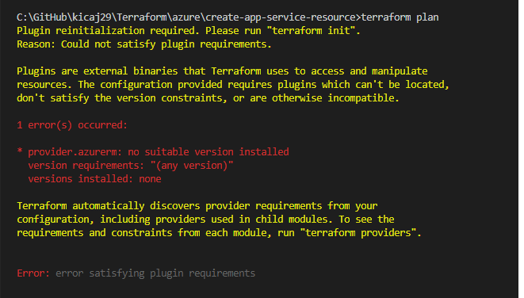
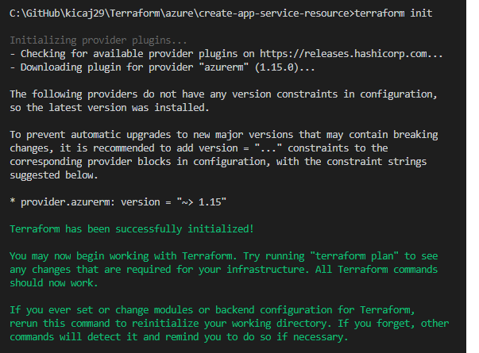

# Terraform

There are 4 basic commands:
* [terraform init](https://www.terraform.io/docs/commands/init.html)
* [terraform plan](https://www.terraform.io/docs/commands/plan.html)
* [terraform apply](https://www.terraform.io/docs/commands/apply.html)
* [terraform destroy](https://www.terraform.io/docs/commands/destroy.html)

NOTE: terraform is not aware of resources created manually in azure portal.

## Terraform for Azure

### Authenticating using the Azure CLI

> We recommend using a Service Principal when running in a shared environment (such as within a CI server/automation) - and authenticating via the Azure CLI when you're running Terraform locally.

It means that Azure CLI has to be installed on local machine.

NOTE: it is helpful to run Azure CLI command `az login` to list all available subscription and check which subscription is default.

### terraform init

   

