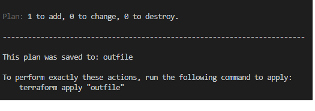
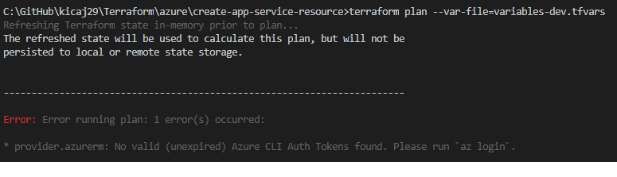

# Terraform

There are 4 basic commands:
* [terraform init](https://www.terraform.io/docs/commands/init.html)
* [terraform plan](https://www.terraform.io/docs/commands/plan.html)   
Usually this command is run with additional parameter that points where is file that stores values of variables.   

```typescript
terraform plan --var-file=variables-dev.tfvars
```
**It looks that at least on Windows `--var-file` has to be used instead of -var-file even documentation says that it should be `-var-file`.**

NOTE: it is good practice to have tfvars file for every supported environment:
variables-dev.tfvars, variables-test.tfvars, variables-preprod.tfvars,
variables-prod.tfvars.   

NOTE1: it is possible to record execution plan to a file and next use it is *apply* command.   

```
terraform plan --var-file=variables-dev.tfvars --out=outfile
```



* [terraform apply](https://www.terraform.io/docs/commands/apply.html)
* [terraform destroy](https://www.terraform.io/docs/commands/destroy.html)
* [Standard Module Structure](https://www.terraform.io/docs/modules/create.html#standard-module-structure)

## Terraform for Azure

**!!---If Terraform is used to provision/configure resources in Azure then only terraform should be used for this task. Resources should not be created/updated by Azure Portal any more because farther terraform executions will fail. Terraform creates execution plan locally and is not aware for operations executed outside of the terraform.---!!**

### Authenticating using the Azure CLI

> We recommend using a Service Principal when running in a shared environment (such as within a CI server/automation) - and authenticating via the Azure CLI when you're running Terraform locally.

It means that Azure CLI has to be installed on local machine.

NOTE: for local development it is mandatory to run in PowerShell Azure CLI command `az login` to have available tokens needed for authorization. If the command is not run then the following error will appear. This command also automatically list all available subscriptions with information which subscription is default.



### terraform init

   


### terraform state and locking
STATE   
Terraform saves current state of provisioned services in terraform.tfstate. It is also possible do store the state in the defined "backend". More can be found [here](https://www.terraform.io/docs/backends/).   

LOCKING   
To avoid changing the same azure resources by multiple jobs/people at the same time [locking](https://www.terraform.io/docs/state/locking.html) mechanism can be used.
