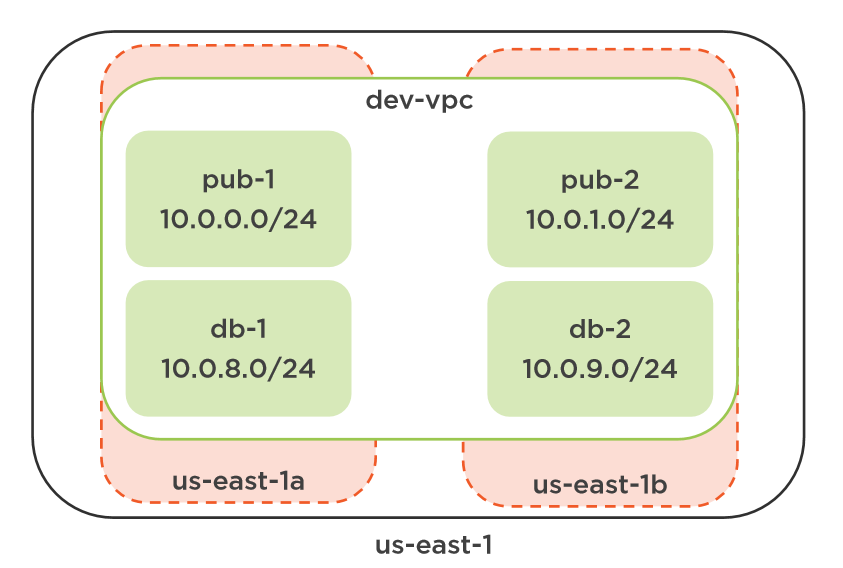

# Authentication methods

* static credentials
    ```tf
    provider "aws" {
    version     = "~> 2.0"
    alias       = ""
    region      = var.region
    access_key  = var.access_key
    secret_key  = var.secret_key
    }
    # alias allows differentiate providers if we have to deal with multiple providers
    ```
* environment variables
    ```tf
    AWS_ACCESS_KEY_ID # Access Key 
    AWS_SECRET_ACCESS_KEY # Secret Key 
    AWS_SHARED_CREDENTIALS_FILE # Location of credential file 
    AWS_PROFILE # Profile name in credentials file 
    AWS_DEFAULT_REGION # Region to use for provider 
    AWS_SESSION_TOKEN # Session token for temporary credential
    ```

* AWS CLI / shared credentials file
* instance profile: profiles are away for a resource in AWS to assume a role from IAM, and that gives it permissions to do certain things within the account or across accounts. Instance profiles are well understood by terraform, and they're typically used in automation situations where your terraform commands will be running from an EC2 instance or container within AWS.


# 01-dev-vpc: VPC deployment

* Region: us-east-1   
* Availability zones: us-east-1a, us-east-1b
* VPC: dev-vpc
  * 2 public facing subnets: pub-1, pub-2
  * 2 subnets for DB services: db-1, db-2



# resources
https://app.pluralsight.com/library/courses/implementing-terraform-aws/table-of-contents   
https://github.com/ned1313/Implementing-Terraform-on-AWS   
https://registry.terraform.io/modules/terraform-aws-modules/vpc/aws/latest
