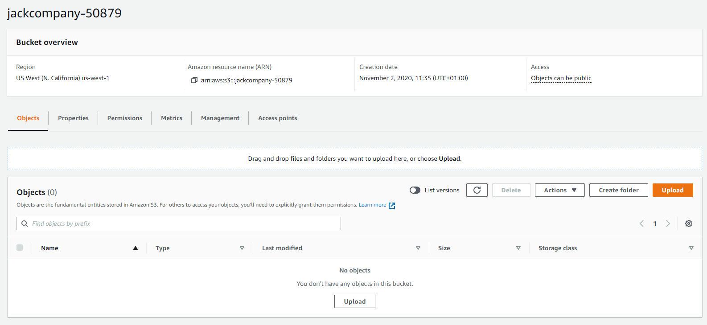
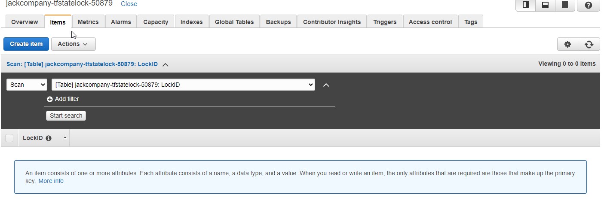
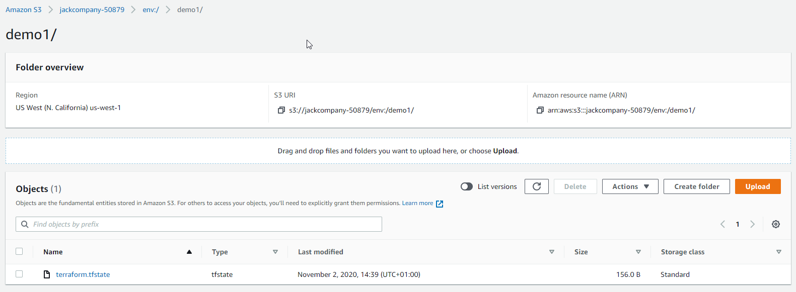
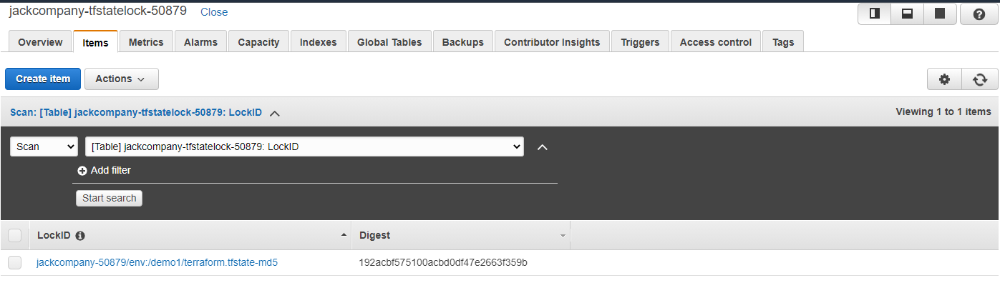
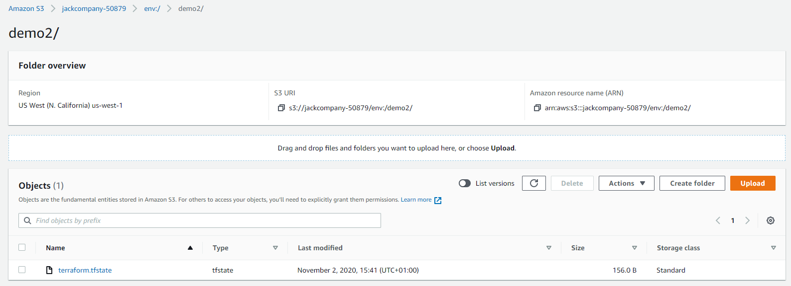
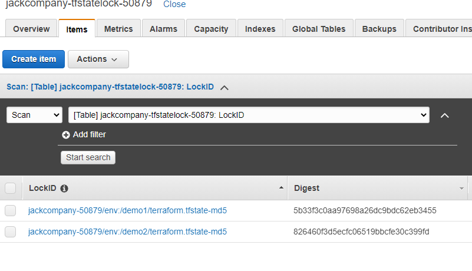

- [create infrastructure for terraform backend](#create-infrastructure-for-terraform-backend)
  - [terraform init for backend](#terraform-init-for-backend)
  - [terraform plan for backend](#terraform-plan-for-backend)
  - [terraform apply for backend](#terraform-apply-for-backend)
  - [terraform destroy for backend](#terraform-destroy-for-backend)
- [use terraform backend](#use-terraform-backend)
  - [terraform init - connect with pointed backend](#terraform-init---connect-with-pointed-backend)
  - [create new workspace demo1](#create-new-workspace-demo1)
  - [terraform plan for demo1](#terraform-plan-for-demo1)
  - [terraform apply for demo1](#terraform-apply-for-demo1)
  - [create new workspace demo2](#create-new-workspace-demo2)
  - [terraform plan for demo2](#terraform-plan-for-demo2)
  - [terraform apply for demo2](#terraform-apply-for-demo2)
  - [terraform destroy for demo1 and demo2](#terraform-destroy-for-demo1-and-demo2)
    - [destroy demo1](#destroy-demo1)
    - [destroy demo2](#destroy-demo2)
- [resources](#resources)

# create infrastructure for terraform backend

[Backend types](https://www.terraform.io/docs/backends/types/index.html):
* standard
* enhanced

Terraform for this part does not use backend to store its state in AWS because it creates the backend.

## terraform init for backend

Terraform init will download necessary plugin for AWS provider.

```
PS D:\GitHub\kicaj29\Terraform\aws\terraform-enhanced-backend\create-backend-infra> terraform init

Initializing the backend...

Initializing provider plugins...
- Finding latest version of hashicorp/local...
- Finding hashicorp/aws versions matching "~> 2.0"...
- Finding latest version of hashicorp/random...
- Installing hashicorp/local v2.0.0...
- Installed hashicorp/local v2.0.0 (signed by HashiCorp)
- Installing hashicorp/aws v2.70.0...
- Installed hashicorp/aws v2.70.0 (signed by HashiCorp)
- Installing hashicorp/random v3.0.0...
- Installed hashicorp/random v3.0.0 (signed by HashiCorp)

The following providers do not have any version constraints in configuration,
so the latest version was installed.

To prevent automatic upgrades to new major versions that may contain breaking
changes, we recommend adding version constraints in a required_providers block
in your configuration, with the constraint strings suggested below.

* hashicorp/local: version = "~> 2.0.0"
* hashicorp/random: version = "~> 3.0.0"

Terraform has been successfully initialized!

You may now begin working with Terraform. Try running "terraform plan" to see
any changes that are required for your infrastructure. All Terraform commands
should now work.

If you ever set or change modules or backend configuration for Terraform,
rerun this command to reinitialize your working directory. If you forget, other
commands will detect it and remind you to do so if necessary.
```

## terraform plan for backend

```
PS D:\GitHub\kicaj29\Terraform\aws\terraform-enhanced-backend\create-backend-infra> terraform plan -out state.tfplan
Refreshing Terraform state in-memory prior to plan...
The refreshed state will be used to calculate this plan, but will not be
persisted to local or remote state storage.


------------------------------------------------------------------------

An execution plan has been generated and is shown below.
Resource actions are indicated with the following symbols:
  + create

Terraform will perform the following actions:

  # aws_dynamodb_table.terraform_statelock will be created
  + resource "aws_dynamodb_table" "terraform_statelock" {
      + arn              = (known after apply)
      + billing_mode     = "PROVISIONED"
      + hash_key         = "LockID"
      + id               = (known after apply)
      + name             = (known after apply)
      + read_capacity    = 20
      + stream_arn       = (known after apply)
      + stream_label     = (known after apply)
      + stream_view_type = (known after apply)
      + write_capacity   = 20

      + attribute {
          + name = "LockID"
          + type = "S"
        }

      + point_in_time_recovery {
          + enabled = (known after apply)
        }

      + server_side_encryption {
          + enabled     = (known after apply)
          + kms_key_arn = (known after apply)
        }
    }

  # aws_s3_bucket.state_bucket will be created
  + resource "aws_s3_bucket" "state_bucket" {
      + acceleration_status         = (known after apply)
      + acl                         = "private"
      + arn                         = (known after apply)
      + bucket                      = (known after apply)
      + bucket_domain_name          = (known after apply)
      + bucket_regional_domain_name = (known after apply)
      + force_destroy               = true
      + hosted_zone_id              = (known after apply)
      + id                          = (known after apply)
      + region                      = (known after apply)
      + request_payer               = (known after apply)
      + website_domain              = (known after apply)
      + website_endpoint            = (known after apply)

      + versioning {
          + enabled    = true
          + mfa_delete = false
        }
    }

  # local_file.user_data_json will be created
  + resource "local_file" "user_data_json" {
      + content              = (known after apply)
      + directory_permission = "0777"
      + file_permission      = "0777"
      + filename             = "output.json"
      + id                   = (known after apply)
    }

  # random_integer.rand will be created
  + resource "random_integer" "rand" {
      + id     = (known after apply)
      + max    = 99999
      + min    = 10000
      + result = (known after apply)
    }

Plan: 4 to add, 0 to change, 0 to destroy.

------------------------------------------------------------------------

This plan was saved to: state.tfplan

To perform exactly these actions, run the following command to apply:
    terraform apply "state.tfplan"
```

## terraform apply for backend

It will create new local file ```output.json``` that contains IDs needed to use this created backend.
This command also creates new bucket and dynamoDB table as infrastructure for backend state.

```
PS D:\GitHub\kicaj29\Terraform\aws\terraform-enhanced-backend\create-backend-infra> terraform apply state.tfplan
random_integer.rand: Creating...
random_integer.rand: Creation complete after 0s [id=50879]
aws_s3_bucket.state_bucket: Creating...
aws_dynamodb_table.terraform_statelock: Creating...
aws_dynamodb_table.terraform_statelock: Creation complete after 9s [id=jackcompany-tfstatelock-50879]
aws_s3_bucket.state_bucket: Still creating... [10s elapsed]
aws_s3_bucket.state_bucket: Creation complete after 14s [id=jackcompany-50879]
local_file.user_data_json: Creating...
local_file.user_data_json: Creation complete after 0s [id=bf66441691cab5e715516deafff7b447fc36e74a]

Apply complete! Resources: 4 added, 0 changed, 0 destroyed.

The state of your infrastructure has been saved to the path
below. This state is required to modify and destroy your
infrastructure, so keep it safe. To inspect the complete state
use the `terraform show` command.

State path: terraform.tfstate

Outputs:

dynamodb_statelock = jackcompany-tfstatelock-50879
s3_bucket = jackcompany-50879
```

## terraform destroy for backend
```
PS D:\GitHub\kicaj29\Terraform\aws\terraform-enhanced-backend\create-backend-infra> terraform destroy
random_integer.rand: Refreshing state... [id=50879]
aws_dynamodb_table.terraform_statelock: Refreshing state... [id=jackcompany-tfstatelock-50879]
aws_s3_bucket.state_bucket: Refreshing state... [id=jackcompany-50879]
local_file.user_data_json: Refreshing state... [id=bf66441691cab5e715516deafff7b447fc36e74a]

An execution plan has been generated and is shown below.
Resource actions are indicated with the following symbols:
  - destroy

Terraform will perform the following actions:

  # aws_dynamodb_table.terraform_statelock will be destroyed
  - resource "aws_dynamodb_table" "terraform_statelock" {
      - arn            = "arn:aws:dynamodb:us-west-1:633883526719:table/jackcompany-tfstatelock-50879" -> null
      - billing_mode   = "PROVISIONED" -> null
      - hash_key       = "LockID" -> null
      - id             = "jackcompany-tfstatelock-50879" -> null
      - name           = "jackcompany-tfstatelock-50879" -> null
      - read_capacity  = 20 -> null
      - stream_enabled = false -> null
      - tags           = {} -> null
      - write_capacity = 20 -> null

      - attribute {
          - name = "LockID" -> null
          - type = "S" -> null
        }

      - point_in_time_recovery {
          - enabled = false -> null
        }

      - ttl {
          - enabled = false -> null
        }
    }

  # aws_s3_bucket.state_bucket will be destroyed
  - resource "aws_s3_bucket" "state_bucket" {
      - acl                         = "private" -> null
      - arn                         = "arn:aws:s3:::jackcompany-50879" -> null
      - bucket                      = "jackcompany-50879" -> null
      - bucket_domain_name          = "jackcompany-50879.s3.amazonaws.com" -> null
      - bucket_regional_domain_name = "jackcompany-50879.s3.us-west-1.amazonaws.com" -> null
      - force_destroy               = true -> null
      - hosted_zone_id              = "Z2F56UZL2M1ACD" -> null
      - id                          = "jackcompany-50879" -> null
      - region                      = "us-west-1" -> null
      - request_payer               = "BucketOwner" -> null
      - tags                        = {} -> null

      - versioning {
          - enabled    = true -> null
          - mfa_delete = false -> null
        }
    }

  # local_file.user_data_json will be destroyed
  - resource "local_file" "user_data_json" {
      - content              = jsonencode(
            {
              - dynamodb_statelock = "jackcompany-tfstatelock-50879"
              - s3_bucket          = "jackcompany-50879"
            }
        ) -> null
      - directory_permission = "0777" -> null
      - file_permission      = "0777" -> null
      - filename             = "output.json" -> null
      - id                   = "bf66441691cab5e715516deafff7b447fc36e74a" -> null
    }

  # random_integer.rand will be destroyed
  - resource "random_integer" "rand" {
      - id     = "50879" -> null
      - max    = 99999 -> null
      - min    = 10000 -> null
      - result = 50879 -> null
    }

Plan: 0 to add, 0 to change, 4 to destroy.

Changes to Outputs:
  - dynamodb_statelock = "jackcompany-tfstatelock-50879" -> null
  - s3_bucket          = "jackcompany-50879" -> null

Do you really want to destroy all resources?
  Terraform will destroy all your managed infrastructure, as shown above.
  There is no undo. Only 'yes' will be accepted to confirm.

  Enter a value: yes

local_file.user_data_json: Destroying... [id=bf66441691cab5e715516deafff7b447fc36e74a]
local_file.user_data_json: Destruction complete after 0s
aws_dynamodb_table.terraform_statelock: Destroying... [id=jackcompany-tfstatelock-50879]
aws_s3_bucket.state_bucket: Destroying... [id=jackcompany-50879]
aws_dynamodb_table.terraform_statelock: Destruction complete after 3s
aws_s3_bucket.state_bucket: Destruction complete after 8s
random_integer.rand: Destroying... [id=50879]
random_integer.rand: Destruction complete after 0s

Destroy complete! Resources: 4 destroyed.
```

# use terraform backend

## terraform init - connect with pointed backend

Terraform init will download necessary plugin for AWS provider and will connect with terraform backend state infrastructure.
>NOTE: it is also possible to pass backend params directly to ```terraform init``` command, for example ```terraform init -backend-config="bucket=BUCKET_NAME" -backend-config="region=REGION_NAME" -backend-config="dynamodb_table=TABLE_NAME"```.

```
PS D:\GitHub\kicaj29\Terraform\aws\terraform-enhanced-backend\use-backend> terraform init

Initializing the backend...

Successfully configured the backend "s3"! Terraform will automatically
use this backend unless the backend configuration changes.

Initializing provider plugins...
- Finding hashicorp/aws versions matching "~> 2.0"...
- Installing hashicorp/aws v2.70.0...
- Installed hashicorp/aws v2.70.0 (signed by HashiCorp)

Terraform has been successfully initialized!

You may now begin working with Terraform. Try running "terraform plan" to see
any changes that are required for your infrastructure. All Terraform commands
should now work.

If you ever set or change modules or backend configuration for Terraform,
rerun this command to reinitialize your working directory. If you forget, other
commands will detect it and remind you to do so if necessary.
```

**At this moment s3 and dynamo table are still empty:**




## create new workspace demo1

```
PS D:\GitHub\kicaj29\Terraform\aws\terraform-enhanced-backend\use-backend> terraform workspace new demo1
Created and switched to workspace "demo1"!

You're now on a new, empty workspace. Workspaces isolate their state,
so if you run "terraform plan" Terraform will not see any existing state
for this configuration.
```

It means that state file has been created and new row was added into dynamoDB table.




Terraform state contains only some metadata:
```json
{
  "version": 4,
  "terraform_version": "0.13.5",
  "serial": 0,
  "lineage": "70507674-88e8-e868-b7be-b24ebdbae5d5",
  "outputs": {},
  "resources": []
}
```

## terraform plan for demo1

We use ```demo1.tfvars``` because demo1 requires different than default EC2 instance type. Checking the plan does not change terraform state.

```
PS D:\GitHub\kicaj29\Terraform\aws\terraform-enhanced-backend\use-backend> terraform plan -var-file="demo1.tfvars" -out demo1-state.tfplan
Acquiring state lock. This may take a few moments...
Refreshing Terraform state in-memory prior to plan...
The refreshed state will be used to calculate this plan, but will not be
persisted to local or remote state storage.


------------------------------------------------------------------------

An execution plan has been generated and is shown below.
Resource actions are indicated with the following symbols:
  + create

Terraform will perform the following actions:

  # aws_instance.example will be created
  + resource "aws_instance" "example" {
      + ami                          = "ami-0e4035ae3f70c400f"
      + arn                          = (known after apply)
      + associate_public_ip_address  = (known after apply)
      + availability_zone            = (known after apply)
      + cpu_core_count               = (known after apply)
      + cpu_threads_per_core         = (known after apply)
      + get_password_data            = false
      + host_id                      = (known after apply)
      + id                           = (known after apply)
      + instance_state               = (known after apply)
      + instance_type                = "t2.small"
      + ipv6_address_count           = (known after apply)
      + ipv6_addresses               = (known after apply)
      + key_name                     = (known after apply)
      + network_interface_id         = (known after apply)
      + outpost_arn                  = (known after apply)
      + password_data                = (known after apply)
      + placement_group              = (known after apply)
      + primary_network_interface_id = (known after apply)
      + private_dns                  = (known after apply)
      + private_ip                   = (known after apply)
      + public_dns                   = (known after apply)
      + public_ip                    = (known after apply)
      + security_groups              = (known after apply)
      + source_dest_check            = true
      + subnet_id                    = (known after apply)
      + tags                         = {
          + "Name" = "demo1-jackcompany"
        }
      + tenancy                      = (known after apply)
      + volume_tags                  = (known after apply)
      + vpc_security_group_ids       = (known after apply)

      + ebs_block_device {
          + delete_on_termination = (known after apply)
          + device_name           = (known after apply)
          + encrypted             = (known after apply)
          + iops                  = (known after apply)
          + kms_key_id            = (known after apply)
          + snapshot_id           = (known after apply)
          + volume_id             = (known after apply)
          + volume_size           = (known after apply)
          + volume_type           = (known after apply)
        }

      + ephemeral_block_device {
          + device_name  = (known after apply)
          + no_device    = (known after apply)
          + virtual_name = (known after apply)
        }

      + metadata_options {
          + http_endpoint               = (known after apply)
          + http_put_response_hop_limit = (known after apply)
          + http_tokens                 = (known after apply)
        }

      + network_interface {
          + delete_on_termination = (known after apply)
          + device_index          = (known after apply)
          + network_interface_id  = (known after apply)
        }

      + root_block_device {
          + delete_on_termination = (known after apply)
          + device_name           = (known after apply)
          + encrypted             = (known after apply)
          + iops                  = (known after apply)
          + kms_key_id            = (known after apply)
          + volume_id             = (known after apply)
          + volume_size           = (known after apply)
          + volume_type           = (known after apply)
        }
    }

Plan: 1 to add, 0 to change, 0 to destroy.

------------------------------------------------------------------------

This plan was saved to: demo1-state.tfplan

To perform exactly these actions, run the following command to apply:
    terraform apply "demo1-state.tfplan"

Releasing state lock. This may take a few moments...
```

## terraform apply for demo1

```
PS D:\GitHub\kicaj29\Terraform\aws\terraform-enhanced-backend\use-backend> terraform apply demo1-state.tfplan
Acquiring state lock. This may take a few moments...
aws_instance.example: Creating...
aws_instance.example: Still creating... [10s elapsed]
aws_instance.example: Still creating... [20s elapsed]
aws_instance.example: Creation complete after 29s [id=i-02bfd87f04de06d61]

Apply complete! Resources: 1 added, 0 changed, 0 destroyed.
Releasing state lock. This may take a few moments...
PS D:\GitHub\kicaj29\Terraform\aws\terraform-enhanced-backend\use-backend>
```

## create new workspace demo2

```
PS D:\GitHub\kicaj29\Terraform\aws\terraform-enhanced-backend\use-backend> terraform workspace new demo2
Created and switched to workspace "demo2"!

You're now on a new, empty workspace. Workspaces isolate their state,
so if you run "terraform plan" Terraform will not see any existing state
for this configuration.
```
Again it will add new entries to S3 and dynamoDB table:




## terraform plan for demo2

For demo2 we do not create tfvars because we want use default values.

```
PS D:\GitHub\kicaj29\Terraform\aws\terraform-enhanced-backend\use-backend> terraform plan -out demo2-state.tfplan
Acquiring state lock. This may take a few moments...
Refreshing Terraform state in-memory prior to plan...
The refreshed state will be used to calculate this plan, but will not be
persisted to local or remote state storage.


------------------------------------------------------------------------

An execution plan has been generated and is shown below.
Resource actions are indicated with the following symbols:
  + create

Terraform will perform the following actions:

  # aws_instance.example will be created
  + resource "aws_instance" "example" {
      + ami                          = "ami-0e4035ae3f70c400f"
      + arn                          = (known after apply)
      + associate_public_ip_address  = (known after apply)
      + availability_zone            = (known after apply)
      + cpu_core_count               = (known after apply)
      + cpu_threads_per_core         = (known after apply)
      + get_password_data            = false
      + host_id                      = (known after apply)
      + id                           = (known after apply)
      + instance_state               = (known after apply)
      + instance_type                = "t2.micro"
      + ipv6_address_count           = (known after apply)
      + ipv6_addresses               = (known after apply)
      + key_name                     = (known after apply)
      + network_interface_id         = (known after apply)
      + outpost_arn                  = (known after apply)
      + password_data                = (known after apply)
      + placement_group              = (known after apply)
      + primary_network_interface_id = (known after apply)
      + private_dns                  = (known after apply)
      + private_ip                   = (known after apply)
      + public_dns                   = (known after apply)
      + public_ip                    = (known after apply)
      + security_groups              = (known after apply)
      + source_dest_check            = true
      + subnet_id                    = (known after apply)
      + tags                         = {
          + "Name" = "demo2-jackcompany"
        }
      + tenancy                      = (known after apply)
      + volume_tags                  = (known after apply)
      + vpc_security_group_ids       = (known after apply)

      + ebs_block_device {
          + delete_on_termination = (known after apply)
          + device_name           = (known after apply)
          + encrypted             = (known after apply)
          + iops                  = (known after apply)
          + kms_key_id            = (known after apply)
          + snapshot_id           = (known after apply)
          + volume_id             = (known after apply)
          + volume_size           = (known after apply)
          + volume_type           = (known after apply)
        }

      + ephemeral_block_device {
          + device_name  = (known after apply)
          + no_device    = (known after apply)
          + virtual_name = (known after apply)
        }

      + metadata_options {
          + http_endpoint               = (known after apply)
          + http_put_response_hop_limit = (known after apply)
          + http_tokens                 = (known after apply)
        }

      + network_interface {
          + delete_on_termination = (known after apply)
          + device_index          = (known after apply)
          + network_interface_id  = (known after apply)
        }

      + root_block_device {
          + delete_on_termination = (known after apply)
          + device_name           = (known after apply)
          + encrypted             = (known after apply)
          + iops                  = (known after apply)
          + kms_key_id            = (known after apply)
          + volume_id             = (known after apply)
          + volume_size           = (known after apply)
          + volume_type           = (known after apply)
        }
    }

Plan: 1 to add, 0 to change, 0 to destroy.

------------------------------------------------------------------------

This plan was saved to: demo2-state.tfplan

To perform exactly these actions, run the following command to apply:
    terraform apply "demo2-state.tfplan"

Releasing state lock. This may take a few moments...
```


## terraform apply for demo2

```
PS D:\GitHub\kicaj29\Terraform\aws\terraform-enhanced-backend\use-backend> terraform apply demo2-state.tfplan
Acquiring state lock. This may take a few moments...
aws_instance.example: Creating...
aws_instance.example: Still creating... [10s elapsed]
aws_instance.example: Still creating... [20s elapsed]
aws_instance.example: Creation complete after 29s [id=i-012cdbdae6a917a98]

Apply complete! Resources: 1 added, 0 changed, 0 destroyed.
Releasing state lock. This may take a few moments...
```

## terraform destroy for demo1 and demo2

We have to destroy both instances:


### destroy demo1

Switch to demo1:
```
PS D:\GitHub\kicaj29\Terraform\aws\terraform-enhanced-backend\use-backend> terraform workspace select demo1
Switched to workspace "demo1".
```

Destroy demo1
```
PS D:\GitHub\kicaj29\Terraform\aws\terraform-enhanced-backend\use-backend> terraform destroy
Acquiring state lock. This may take a few moments...
aws_instance.example: Refreshing state... [id=i-02bfd87f04de06d61]

An execution plan has been generated and is shown below.
Resource actions are indicated with the following symbols:
  - destroy

Terraform will perform the following actions:

  # aws_instance.example will be destroyed
  - resource "aws_instance" "example" {
      - ami                          = "ami-0e4035ae3f70c400f" -> null
      - arn                          = "arn:aws:ec2:us-west-1:633883526719:instance/i-02bfd87f04de06d61" -> null
      - associate_public_ip_address  = true -> null
      - availability_zone            = "us-west-1a" -> null
      - cpu_core_count               = 1 -> null
      - cpu_threads_per_core         = 1 -> null
      - disable_api_termination      = false -> null
      - ebs_optimized                = false -> null
      - get_password_data            = false -> null
      - hibernation                  = false -> null
      - id                           = "i-02bfd87f04de06d61" -> null
      - instance_state               = "running" -> null
      - instance_type                = "t2.small" -> null
      - ipv6_address_count           = 0 -> null
      - ipv6_addresses               = [] -> null
      - monitoring                   = false -> null
      - primary_network_interface_id = "eni-0b0c14a5d7e21b295" -> null
      - private_dns                  = "ip-172-31-27-242.us-west-1.compute.internal" -> null
      - private_ip                   = "172.31.27.242" -> null
      - public_dns                   = "ec2-52-53-243-180.us-west-1.compute.amazonaws.com" -> null
      - public_ip                    = "52.53.243.180" -> null
      - security_groups              = [
          - "default",
        ] -> null
      - source_dest_check            = true -> null
      - subnet_id                    = "subnet-d74dfdb1" -> null
      - tags                         = {
          - "Name" = "demo1-jackcompany"
        } -> null
      - tenancy                      = "default" -> null
      - volume_tags                  = {} -> null
      - vpc_security_group_ids       = [
          - "sg-76949a02",
        ] -> null

      - credit_specification {
          - cpu_credits = "standard" -> null
        }

      - metadata_options {
          - http_endpoint               = "enabled" -> null
          - http_put_response_hop_limit = 1 -> null
          - http_tokens                 = "optional" -> null
        }

      - root_block_device {
          - delete_on_termination = true -> null
          - device_name           = "/dev/xvda" -> null
          - encrypted             = false -> null
          - iops                  = 100 -> null
          - volume_id             = "vol-02c21fbeb3296662c" -> null
          - volume_size           = 8 -> null
          - volume_type           = "gp2" -> null
        }
    }

Plan: 0 to add, 0 to change, 1 to destroy.

Do you really want to destroy all resources in workspace "demo1"?
  Terraform will destroy all your managed infrastructure, as shown above.
  There is no undo. Only 'yes' will be accepted to confirm.

  Enter a value: yes

aws_instance.example: Destroying... [id=i-02bfd87f04de06d61]
aws_instance.example: Still destroying... [id=i-02bfd87f04de06d61, 10s elapsed]
aws_instance.example: Still destroying... [id=i-02bfd87f04de06d61, 20s elapsed]
aws_instance.example: Still destroying... [id=i-02bfd87f04de06d61, 30s elapsed]
aws_instance.example: Destruction complete after 33s

Destroy complete! Resources: 1 destroyed.
Releasing state lock. This may take a few moments...
```

Workspace for demo1 still exist but it state contains only metadata:
```
PS D:\GitHub\kicaj29\Terraform\aws\terraform-enhanced-backend\use-backend> terraform workspace list
  default
* demo1
  demo2
```

### destroy demo2

Switch to demo2:
```
PS D:\GitHub\kicaj29\Terraform\aws\terraform-enhanced-backend\use-backend> terraform workspace select demo2
Switched to workspace "demo2".
```

Destroy demo2:
```
PS D:\GitHub\kicaj29\Terraform\aws\terraform-enhanced-backend\use-backend> terraform destroy
Acquiring state lock. This may take a few moments...
aws_instance.example: Refreshing state... [id=i-012cdbdae6a917a98]

An execution plan has been generated and is shown below.
Resource actions are indicated with the following symbols:
  - destroy

Terraform will perform the following actions:

  # aws_instance.example will be destroyed
  - resource "aws_instance" "example" {
      - ami                          = "ami-0e4035ae3f70c400f" -> null
      - arn                          = "arn:aws:ec2:us-west-1:633883526719:instance/i-012cdbdae6a917a98" -> null
      - associate_public_ip_address  = true -> null
      - availability_zone            = "us-west-1a" -> null
      - cpu_core_count               = 1 -> null
      - cpu_threads_per_core         = 1 -> null
      - disable_api_termination      = false -> null
      - ebs_optimized                = false -> null
      - get_password_data            = false -> null
      - hibernation                  = false -> null
      - id                           = "i-012cdbdae6a917a98" -> null
      - instance_state               = "running" -> null
      - instance_type                = "t2.micro" -> null
      - ipv6_address_count           = 0 -> null
      - ipv6_addresses               = [] -> null
      - monitoring                   = false -> null
      - primary_network_interface_id = "eni-0a7d6549748f4036b" -> null
      - private_dns                  = "ip-172-31-31-26.us-west-1.compute.internal" -> null
      - private_ip                   = "172.31.31.26" -> null
      - public_dns                   = "ec2-54-151-18-195.us-west-1.compute.amazonaws.com" -> null
      - public_ip                    = "54.151.18.195" -> null
      - security_groups              = [
          - "default",
        ] -> null
      - source_dest_check            = true -> null
      - subnet_id                    = "subnet-d74dfdb1" -> null
      - tags                         = {
          - "Name" = "demo2-jackcompany"
        } -> null
      - tenancy                      = "default" -> null
      - volume_tags                  = {} -> null
      - vpc_security_group_ids       = [
          - "sg-76949a02",
        ] -> null

      - credit_specification {
          - cpu_credits = "standard" -> null
        }

      - metadata_options {
          - http_endpoint               = "enabled" -> null
          - http_put_response_hop_limit = 1 -> null
          - http_tokens                 = "optional" -> null
        }

      - root_block_device {
          - delete_on_termination = true -> null
          - device_name           = "/dev/xvda" -> null
          - encrypted             = false -> null
          - iops                  = 100 -> null
          - volume_id             = "vol-073b874691466a51b" -> null
          - volume_size           = 8 -> null
          - volume_type           = "gp2" -> null
        }
    }

Plan: 0 to add, 0 to change, 1 to destroy.

Do you really want to destroy all resources in workspace "demo2"?
  Terraform will destroy all your managed infrastructure, as shown above.
  There is no undo. Only 'yes' will be accepted to confirm.

  Enter a value: yes

aws_instance.example: Destroying... [id=i-012cdbdae6a917a98]
aws_instance.example: Still destroying... [id=i-012cdbdae6a917a98, 10s elapsed]
aws_instance.example: Still destroying... [id=i-012cdbdae6a917a98, 20s elapsed]
aws_instance.example: Still destroying... [id=i-012cdbdae6a917a98, 30s elapsed]
aws_instance.example: Still destroying... [id=i-012cdbdae6a917a98, 40s elapsed]
aws_instance.example: Destruction complete after 44s

Destroy complete! Resources: 1 destroyed.
Releasing state lock. This may take a few moments...
```

# resources

https://app.pluralsight.com/library/courses/implementing-terraform-aws/table-of-contents   
https://blog.gruntwork.io/how-to-manage-terraform-state-28f5697e68fa   
https://www.terraform.io/docs/backends/types/s3.html   
https://discuss.hashicorp.com/t/how-to-use-templatefile-when-writing-terraform-files-in-json/1906/2